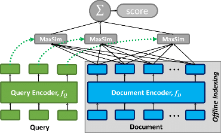

----
----

**NOTE: This branch has the code for [ColBERTv1](https://arxiv.org/abs/2004.12832). The  [`main` branch](https://github.com/stanford-futuredata/ColBERT/tree/main) contains a new simpler API plus the code for the new [ColBERTv2](https://arxiv.org/abs/2112.01488) model with [PLAID](https://arxiv.org/abs/2205.09707) performance optimizations, including a public checkpoint as well as a public release of our LoTTE benchmark.**

----

----


# ColBERT

### ColBERT is a _fast_ and _accurate_ retrieval model, enabling scalable BERT-based search over large text collections in tens of milliseconds. 

<p align="center">
  
</p>
<p align="center">
  <b>Figure 1:</b> ColBERT's late interaction, efficiently scoring the fine-grained similarity between a queries and a passage.
</p>

As Figure 1 illustrates, ColBERT relies on fine-grained **contextual late interaction**: it encodes each passage into a **matrix** of token-level embeddings (shown above in blue). Then at search time, it embeds every query into another matrix (shown in green) and efficiently finds passages that contextually match the query using scalable vector-similarity (`MaxSim`) operators.

These rich interactions allow ColBERT to surpass the quality of _single-vector_ representation models, while scaling efficiently to large corpora. You can read more in our papers:

* [**ColBERT: Efficient and Effective Passage Search via Contextualized Late Interaction over BERT**](https://arxiv.org/abs/2004.12832) (SIGIR'20).
* [**Relevance-guided Supervision for OpenQA with ColBERT**](https://arxiv.org/abs/2007.00814) (TACL'21).
* [**ColBERTv2: Effective and Efficient Retrieval via Lightweight Late Interaction**](https://arxiv.org/abs/2112.01488) (to appear at NAACL'22).

----

## Installation

ColBERT (currently: [v0.2.0](#releases)) requires Python 3.7+ and Pytorch 1.6+ and uses the [HuggingFace Transformers](https://github.com/huggingface/transformers) library.

We strongly recommend creating a conda environment using:

```
conda env create -f conda_env.yml
conda activate colbert-v0.2
```

If you face any problems, please [open a new issue](https://github.com/stanford-futuredata/ColBERT/issues) and we'll help you promptly!


## Overview

Using ColBERT on a dataset typically involves the following steps.

**Step 0: Preprocess your collection.** At its simplest, ColBERT works with tab-separated (TSV) files: a file (e.g., `collection.tsv`) will contain all passages and another (e.g., `queries.tsv`) will contain a set of queries for searching the collection.

**Step 1: Train a ColBERT model.**  You can [train your own ColBERT model](#training) and [validate performance](#validation) on a suitable development set.

**Step 2: Index your collection.** Once you're happy with your ColBERT model, you need to [index your collection](#indexing) to permit fast retrieval. This step encodes all passages into matrices, stores them on disk, and builds data structures for efficient search.

**Step 3: Search the collection with your queries.** Given your model and index, you can [issue queries over the collection](#retrieval) to retrieve the top-k passages for each query.

Below, we illustrate these steps via an example run on the MS MARCO Passage Ranking task.


## Data

This repository works directly with a simple **tab-separated file** format to store queries, passages, and top-k ranked lists.


* Queries: each line is `qid \t query text`.
* Collection: each line is `pid \t passage text`. 
* Top-k Ranking: each line is `qid \t pid \t rank`.

This works directly with the data format of the [MS MARCO Passage Ranking](https://github.com/microsoft/MSMARCO-Passage-Ranking) dataset. You will need the training triples (`triples.train.small.tar.gz`), the official top-1000 ranked lists for the dev set queries (`top1000.dev`), and the dev set relevant passages (`qrels.dev.small.tsv`). For indexing the full collection, you will also need the list of passages (`collection.tar.gz`).


## Training

Training requires a list of _<query, positive passage, negative passage>_ tab-separated triples.

You can supply **full-text** triples, where each line is `query text \t positive passage text \t negative passage text`. Alternatively, you can supply the query and passage **IDs** as a JSONL file `[qid, pid+, pid-]` per line, in which case you should specify `--collection path/to/collection.tsv` and `--queries path/to/queries.train.tsv`.


```
CUDA_VISIBLE_DEVICES="0,1,2,3" \
python -m torch.distributed.launch --nproc_per_node=4 -m \
colbert.train --amp --doc_maxlen 180 --mask-punctuation --bsize 32 --accum 1 \
--triples /path/to/MSMARCO/triples.train.small.tsv \
--root /root/to/experiments/ --experiment MSMARCO-psg --similarity l2 --run msmarco.psg.l2
```

You can use one or more GPUs by modifying `CUDA_VISIBLE_DEVICES` and `--nproc_per_node`.


## Validation

Before indexing into ColBERT, you can compare a few checkpoints by re-ranking a top-k set of documents per query. This will use ColBERT _on-the-fly_: it will compute document representations _during_ query evaluation.

This script requires the top-k list per query, provided as a tab-separated file whose every line contains a tuple `queryID \t passageID \t rank`, where rank is {1, 2, 3, ...} for each query. The script also accepts the format of MS MARCO's `top1000.dev` and `top1000.eval` and you can optionally supply relevance judgements (qrels) for evaluation. This is a tab-separated file whose every line has a quadruple _<query ID, 0, passage ID, 1>_, like `qrels.dev.small.tsv`.

Example command:

```
python -m colbert.test --amp --doc_maxlen 180 --mask-punctuation \
--collection /path/to/MSMARCO/collection.tsv \
--queries /path/to/MSMARCO/queries.dev.small.tsv \
--topk /path/to/MSMARCO/top1000.dev  \
--checkpoint /root/to/experiments/MSMARCO-psg/train.py/msmarco.psg.l2/checkpoints/colbert-200000.dnn \
--root /root/to/experiments/ --experiment MSMARCO-psg  [--qrels path/to/qrels.dev.small.tsv]
```


## Indexing

For fast retrieval, indexing precomputes the ColBERT representations of passages.

Example command:

```
CUDA_VISIBLE_DEVICES="0,1,2,3" OMP_NUM_THREADS=6 \
python -m torch.distributed.launch --nproc_per_node=4 -m \
colbert.index --amp --doc_maxlen 180 --mask-punctuation --bsize 256 \
--checkpoint /root/to/experiments/MSMARCO-psg/train.py/msmarco.psg.l2/checkpoints/colbert-200000.dnn \
--collection /path/to/MSMARCO/collection.tsv \
--index_root /root/to/indexes/ --index_name MSMARCO.L2.32x200k \
--root /root/to/experiments/ --experiment MSMARCO-psg
```

The index created here allows you to re-rank the top-k passages retrieved by another method (e.g., BM25).

We typically recommend that you use ColBERT for **end-to-end** retrieval, where it directly finds its top-k passages from the full collection. For this, you need FAISS indexing.


#### FAISS Indexing for end-to-end retrieval

For end-to-end retrieval, you should index the document representations into [FAISS](https://github.com/facebookresearch/faiss).

```
python -m colbert.index_faiss \
--index_root /root/to/indexes/ --index_name MSMARCO.L2.32x200k \
--partitions 32768 --sample 0.3 \
--root /root/to/experiments/ --experiment MSMARCO-psg
```


## Retrieval

In the simplest case, you want to retrieve from the full collection:

```
python -m colbert.retrieve \
--amp --doc_maxlen 180 --mask-punctuation --bsize 256 \
--queries /path/to/MSMARCO/queries.dev.small.tsv \
--nprobe 32 --partitions 32768 --faiss_depth 1024 \
--index_root /root/to/indexes/ --index_name MSMARCO.L2.32x200k \
--checkpoint /root/to/experiments/MSMARCO-psg/train.py/msmarco.psg.l2/checkpoints/colbert-200000.dnn \
--root /root/to/experiments/ --experiment MSMARCO-psg
```

You may also want to re-rank a top-k set that you've retrieved before with ColBERT or with another model. For this, use `colbert.rerank` similarly and additionally pass `--topk`.

If you have a large set of queries (or want to reduce memory usage), use **batch-mode** retrieval and/or re-ranking. This can be done by passing `--batch --retrieve_only` to `colbert.retrieve` and passing `--batch --log-scores` to colbert.rerank alongside `--topk` with the `unordered.tsv` output of this retrieval run.

Some use cases (e.g., building a user-facing search engines) require more control over retrieval. For those, you typically don't want to use the command line for retrieval. Instead, you want to import our retrieval API from Python and directly work with that (e.g., to build a simple REST API). Instructions for this are coming soon, but you will just need to adapt/modify the retrieval loop in [`colbert/ranking/retrieval.py#L33`](colbert/ranking/retrieval.py#L33).


## Releases

* v0.2.0: Sep 2020
* v0.1.0: June 2020

